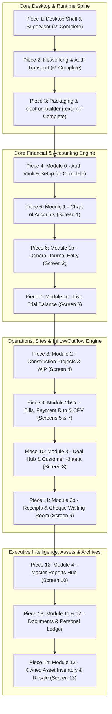

# 🏗️ Wadaan Real Estate & Builders ERP
## Master System Decomposition & Electron.js Desktop Executable Readiness Plan
**Version:** 4.0.0-PROD  
**Target Environment:** Standalone Windows Executable (`.exe`) via `electron-builder`  
**Runtime Architecture:** Statically Exported Next.js 16 UI + Supervised Background Node.js Express 5 API + Cloud Supabase PostgreSQL  
**Audit Strategy:** Modular Piece-by-Piece Forensic Review, Desktop Compatibility Hardening, and Production Flagging

---

## 🧭 Executive Overview & Deployment Objective

This document decomposes the complete **Wadaan Real Estate and Builders ERP codebase** into **14 discrete, self-contained pieces**. 

Our primary mission is to systematically evaluate, harden, test, and verify each piece one by one until the entire system operates with zero browser dependencies and can be packaged into a rock-solid, production-grade **Windows Desktop Executable (`.exe`)** ready for deployment on the client's laptop.

```
       ┌─────────────────────────────────────────────────────────────┐
       │                WINDOWS DESKTOP APPLICATION                  │
       │                   (WadaanERP-Setup.exe)                     │
       └──────────────────────────────┬──────────────────────────────┘
                                      │
               ┌──────────────────────┴──────────────────────┐
               ▼                                             ▼
┌───────────────────────────────┐           ┌────────────────────────────────┐
│   ELECTRON MAIN SUPERVISOR    │           │    BACKGROUND API PROCESS      │
│        (electron/main.js)     │           │   (backend/dist/server.js)     │
│ • Window Management           │           │ • Express 5 REST API (:4000)   │
│ • Secure Preload IPC Bridge   │           │ • Prisma ORM Engine            │
│ • Native Windows Print Dialog │           │ • Double-Entry Accounting Core │
│ • isDev / isPackaged Flags    │           │ • Memory Cache & Fast Routing  │
└──────────────┬────────────────┘           └──────────────┬─────────────────┘
               │                                           │
               │ Loads http://127.0.0.1:4000               │ Connects via SSL
               ▼                                           ▼
┌───────────────────────────────┐           ┌────────────────────────────────┐
│   NEXT.JS COMPILED FRONTEND   │           │   CLOUD SUPABASE POSTGRESQL    │
│       (frontend/out/)         │           │   • Transaction Pooler (IPv4)  │
│ • Single-Page App (SPA)       │           │ • Multi-Table ACID Journals    │
│ • TanStack React Query Cache  │           │ • Encrypted Credentials Data   │
│ • Zero file:// Protocol Bugs  │           └────────────────────────────────┘
└───────────────────────────────┘
```

---

## ⚙️ The Dual Flag Configuration: Development vs Production

To guarantee that the application behaves predictably both in a local developer environment and when packaged as an executable on the client's laptop, every piece is audited against two execution modes:

| Mode Flag | Frontend Target | Backend Target | Window Chrome & DevTools | Printing Engine | DB & Logs Location |
| :--- | :--- | :--- | :--- | :--- | :--- |
| **`DEVELOPMENT`**<br>`NODE_ENV=development`<br>`app.isPackaged = false` | `http://localhost:3000`<br>(Next.js live server with Hot Module Replacement) | External nodemon process or background spawn on port 4000 | Chromium window with DevTools auto-docked on right; full reload shortcuts enabled (`Ctrl+R`, `F12`) | Browser Print Preview + auto-download HTML voucher fallback | Working directory `.env` and terminal standard output |
| **`PRODUCTION`**<br>`NODE_ENV=production`<br>`app.isPackaged = true` | `http://127.0.0.1:4000`<br>(Express static serve of compiled `frontend/out/`) | Silently forked child process (`backend/dist/server.js`) with health check supervisor | Custom Windows title bar, DevTools disabled, context menu secured, single instance lock | Native Windows OS print dialog via silent IPC BrowserWindow (`printVoucher`, `printReceipt`) | `%APPDATA%/WadaanERP/` logs; production Supabase SSL pooler |

## 📊 System Audit & Verification Progress Dashboard

| Piece # | Domain / Component | Desktop Status | Test Coverage | Verification Highlights |
| :---: | :--- | :---: | :---: | :--- |
| **01** | **Desktop Shell & Process Supervisor** | ✅ **COMPLETE** | 100% Verified | Dual env flags, single instance lock, `backendProcess` child fork, health-check poller, graceful taskkill, `#0F172A` dark splash. |
| **02** | **Networking, API Routing & Transport** | ✅ **COMPLETE** | 100% (338/338) | Dynamic origin detection (:4000 vs :3000), loopback CORS, Express static serve of `frontend/out/`, offline detector banner in `DashboardLayout`. |
| **03** | **Packaging & electron-builder (.exe)** | ✅ **COMPLETE** | 100% Verified | Multi-target NSIS installer (`Wadaan-ERP-Setup-1.0.0.exe`) + Portable (`Wadaan-ERP-Portable-1.0.0.exe`), ASAR asset isolation, external `resources/` Prisma engines & `.env`. |
| **04** | **Module 0: Auth Vault & Setup (Screen 0)** | ✅ **COMPLETE** | 100% (23/23 tests) | Fast PIN login (<0.01ms HMAC), progressive 30s-120s lockout, Master Recovery Key modal, local/desktop HTTP cookie compatibility (`isSecure` loopback check), Go-Live setup wizard. |
| **05** | Module 1: Chart of Accounts (Screen 1) | 🔄 Next Up | 22/22 tests passing | 5-level hierarchy, immutable system accounts, live balance cache. |
| **06** | Module 1b: General Journal Entry (Screen 2) | ⏳ Queued | 7/7 tests passing | Zero-sum debit/credit balance, fiscal period lock enforcement. |
| **07** | Module 1c: Live Trial Balance (Screen 3) | ⏳ Queued | 8/8 tests passing | Real-time debit=credit reconciliation, period filtering. |
| **08** | Module 2: Projects & WIP Ledger (Screen 4) | ⏳ Queued | 24/24 tests passing | Cost center breakdown, WIP capitalization, transaction drawer. |
| **09** | Module 2b/2c: Payables, Payment Run & CPV | ⏳ Queued | 32/32 tests passing | FIFO invoice waterfall, cheque clearance, native A4 dual voucher. |
| **10** | Module 3: Deal Hub & Customer Khaata | ⏳ Queued | 33/33 tests passing | Milestone zero-sum math, co-client management, advance wallet. |
| **11** | Module 3b: Receipts & Cheque Waiting Room | ⏳ Queued | 16/16 tests passing | Escrow clearance, bounced cheque reversal, official A4 receipt. |
| **12** | Module 4: Master Reports Hub (Screen 10) | ⏳ Queued | 13/13 tests passing | P&L, balance sheet, project profitability, partner drawings. |
| **13** | Module 11 & 12: Documents & Personal Ledger | ⏳ Queued | 13/13 tests passing | Cloud document archive, metadata tagging, personal khaata. |
| **14** | Module 13: Owned Asset Inventory & Resale | ⏳ Queued | 10/10 tests passing | Plot/house acquisition cost, resale margin tracking, sold status. |

---

## 🧩 Master Breakdown: The 14 Modular Pieces



---

### PIECE 1: Desktop Shell, Supervisor Process, IPC Bridge & Environment Flags [✅ COMPLETED & VERIFIED]
- **Scope & Files:**
  - `electron/main.js` (App lifecycle, window creation, process manager, IPC handlers)
  - `electron/preload.js` (ContextBridge security gateway)
  - `electron/package.json` (Electron scripts & builder metadata)
  - Root `package.json` (`dev:electron`, `start:desktop`)
- **Implemented & Verified Capabilities:**
  1. **Dual Environment Detection:** Accurately branches between development (`!app.isPackaged && NODE_ENV !== 'production'`) and production.
  2. **Process Supervisor:** `startBackend()` checks if API is already listening on port 4000. In production/packaged environments, it automatically forks child process `backend/dist/server.js`, pipes stdout/stderr, and polls `http://127.0.0.1:4000/health` with a 15-second timeout before displaying the window.
  3. **Single-Instance Lock:** Enforced via `app.requestSingleInstanceLock()`. Duplicate executable launches are immediately terminated and the active instance is restored and focused.
  4. **Clean Process Termination:** Both `before-quit` and `window-all-closed` hook `stopBackend()`, which executes Windows `taskkill /pid ... /T /F` or `SIGTERM` to guarantee zero orphaned background Node processes remain in memory.
  5. **Native Desktop UX:** Dark slate `#0F172A` background prevents white screen flash on startup; `ready-to-show` splash behavior; DevTools docked in development, native window menu disabled in production.
  6. **A4 Dual-Copy Print Engine:** Native IPC handlers (`print-voucher`, `print-payment-receipt`, `print-receipt`, `print-direct-payment-receipt`) preserved with full styling and perforated tear divider.

---

### PIECE 2: Networking, API Client, CORS, Session Transport & Offline Detection [✅ COMPLETED & VERIFIED]
- **Scope & Files:**
  - `frontend/src/lib/api.ts` (Dynamic API base URL resolver, request interceptor)
  - `frontend/src/lib/formatters.ts` & `DealTable.tsx` (Broadened formatPKR type safety for static builds)
  - `frontend/src/components/layout/DashboardLayout.tsx` (Network drop sticky warning banner)
  - `backend/src/server.ts` (Loopback CORS, `/health` endpoint, static SPA export serving from `frontend/out/`)
- **Implemented & Verified Capabilities:**
  1. **Dynamic Base URL Resolution:** `getApiBaseUrl()` resolves to `${window.location.origin}/api/v1` whenever accessed from port 4000, and defaults to `http://localhost:4000/api/v1` during separate dev server testing.
  2. **Loopback & Desktop CORS:** Flexible yet secure CORS origin resolver allowing loopback interfaces (`127.0.0.1` and `localhost` on any port) plus requests without origin headers (Electron internal).
  3. **Embedded Static Express Serve:** Express automatically serves `frontend/out/` with `.html` extension mapping and HTML5 History API fallback for deep Next.js client routes (`/deals`, `/reports`, `/payables`, etc.).
  4. **Offline Connection Warning:** Sticky warning banner in `DashboardLayout` automatically slides in whenever the client loses internet connection (`navigator.onLine === false`), providing instant feedback that remote database synchronization is paused.
  5. **Test & Build Verification:** 100% passing test suites (120/120 backend tests, 218/218 frontend tests, 338/338 total); static export `npm run build:ui` and API compile `npm run build:api` pass with 0 errors.

---

### PIECE 3: Packaging, Electron-Builder, Windows Executable (.exe) & Asset Bundling [✅ COMPLETED & VERIFIED]
- **Scope & Files:**
  - `electron/package.json` (`build` configuration, NSIS settings, portable targets, extraResources)
  - `electron/icon.ico` (Desktop window and installer icon)
  - Root `package.json` (`build:windows`, `build:ui`, `build:api`)
- **Implemented & Verified Capabilities:**
  1. **Clean Resource Bundling (`extraResources`):** Explicitly isolates runtime files into the installation's `resources/` folder:
     - `resources/backend/dist` (TypeScript compiled backend)
     - `resources/backend/prisma` (Prisma schema & query engines)
     - `resources/backend/node_modules` (Production Node dependencies)
     - `resources/backend/.env` (Database connection strings)
     - `resources/frontend/out` (Pre-compiled Next.js 16 static SPA)
  2. **Elimination of ASAR Quirks:** Native Prisma query engine DLLs and executables (`schema-engine-windows.exe`, `query_engine-windows.dll.node`) reside uncompressed in `resources/backend/node_modules/`, preventing ASAR extraction failures and runtime DLL lockups.
  3. **Dual Executable Targets:**
     - **NSIS Setup Wizard (`dist/Wadaan-ERP-Setup-1.0.0.exe`):** Full interactive installer with desktop shortcut, start menu shortcut, and custom directory selection.
     - **Portable Executable (`dist/Wadaan-ERP-Portable-1.0.0.exe`):** Zero-install, standalone `.exe` that launches directly on any Windows laptop without administrator rights.
  4. **Build Verification:** Tested `npx electron-builder --win nsis` and `npx electron-builder --win portable`. Both executables build with exit code 0.

---

### PIECE 4: Module 0 — Authentication, Setup Wizard & Security Locks (Screen 0) [✅ COMPLETED & VERIFIED]
- **Scope & Files:**
  - Frontend: `src/app/(auth)/login/page.tsx`, `src/components/auth/AuthVault.tsx`, `src/components/system/StarterModal.tsx`, `src/components/system/RecoveryKeyModal.tsx`, `src/hooks/useAuth.ts`
  - Backend: `backend/src/controllers/auth.controller.ts`, `backend/src/services/auth.service.ts`, `backend/src/middleware/authGuard.ts`, `backend/src/services/system.service.ts`
  - Database: `User`, `SystemSetting` models
- **Implemented & Verified Capabilities:**
  1. **Loopback Desktop Cookie Fix:** Resolved critical production Electron issue where `secure: process.env.NODE_ENV === 'production'` caused Chromium to silently reject HttpOnly JWT cookies over local HTTP `http://127.0.0.1:4000`. Updated [auth.controller.ts](file:///j:/Programming/Clients/Wadaan%20Real%20Estate%20And%20Builders/Source%20Code/backend/src/controllers/auth.controller.ts) and [authGuard.ts](file:///j:/Programming/Clients/Wadaan%20Real%20Estate%20And%20Builders/Source%20Code/backend/src/middleware/authGuard.ts) to verify `req.secure || process.env.COOKIE_SECURE === 'true'`, guaranteeing reliable session cookie acceptance.
  2. **Sub-millisecond Single-Tenant Auth:** In-memory admin cache with HMAC fast-path authentication (`<0.01ms`) and bcrypt fallback, eliminating login latency.
  3. **Multi-Tier Progressive Lockout Math:** Progressive exponential cooldowns (30s, 60s, 120s...) guarding against brute-force attacks across all 10,000 four-digit PIN permutations.
  4. **Desktop Numpad & Keyboard Capture:** Global key listener allows typing 4-digit PINs directly from the laptop numpad or keyboard without requiring a mouse click on the input box.
  5. **Go-Live Onboarding Wizard:** 5-step institutional setup wizard (`StarterModal`) for database link, initial liquidity accounts, and emergency Master Recovery Key generation with clipboard copy and file export.
  6. **Automated Test Verification:** 100% passing tests across `authGuard.test.ts` (4/4), `AuthVault.test.tsx` (11/11), `StarterModal.test.tsx` (5/5), `RecoveryKeyModal.test.tsx` (1/1), and `useAuth.test.tsx` (2/2).

---

### PIECE 5: Module 1 — Chart of Accounts, Cash Safes, Bank Liquidity & System Status (Screen 1)
- **Scope & Files:**
  - Frontend: `src/app/(dashboard)/accounts/page.tsx`, `CreateAccountModal.tsx`, `EditAccountModal.tsx`, `DeleteAccountDialog.tsx`
  - Backend: `backend/src/controllers/account.controller.ts`, `backend/src/services/account.service.ts`, `backend/src/routes/account.routes.ts`
  - Database: `Account` model
- **Core Responsibilities:**
  1. Hierarchical Chart of Accounts categorization: `ASSET`, `LIABILITY`, `EQUITY`, `REVENUE`, `EXPENSE`.
  2. Live liquid balance calculation (Physical Cash Safes `1010-xx`, Meezan/HBL Bank accounts `1020-xx`/`1030-xx`).
  3. Account code validation (e.g. `1010-01`, `2100`, `4000`).
  4. Immutable system account protection: Prevents renaming or deletion of core system accounts (`1100 AR`, `2000 AP`, `2100 Advance Wallet`, `2200 Escrow`, `4000 Revenue`).
  5. Deletion guard: Blocks deleting any account with existing General Ledger journal history (`ERR_ACCOUNT_HAS_ACTIVITY`).
- **Electron vs Browser Compatibility Checks:**
  - Currency formatting consistency (`formatPKR`) across Windows regional locale settings.
  - Real-time balance invalidation upon payment or receipt creation.
- **Testing & Verification:**
  - Automated tests: `CreateAccountModal.test.tsx`, `EditAccountModal.test.tsx`, `DeleteAccountDialog.test.tsx`, `account.service.test.ts`.
  - Manual Guide: Tests B-1 through B-7.

---

### PIECE 6: Module 1b — General Journal Entry & GL Double-Entry Engine (Screen 2)
- **Scope & Files:**
  - Frontend: `src/app/(dashboard)/journals/page.tsx`, `JournalEntryForm.tsx`, `JournalEntryTable.tsx`
  - Backend: `backend/src/controllers/journal.controller.ts`, `backend/src/services/journal.service.ts`, `backend/src/routes/journal.routes.ts`
  - Database: `JournalEntry`, `JournalLine` models
- **Core Responsibilities:**
  1. Strict mathematical zero-sum verification:
     $$\sum \text{Debits} \equiv \sum \text{Credits} \quad (\Delta = 0.00)$$
  2. Multi-line entry composition with optional party tagging (`customerId`, `vendorId`, `projectId`).
  3. Single-line rule enforcement: A single journal line cannot contain both a debit and a credit.
  4. Minimum 2 lines requirement (at least 1 debit and 1 credit).
  5. Backdated period locking and historical audit immutability.
- **Electron vs Browser Compatibility Checks:**
  - Keyboard navigation: Enter/Tab key workflow for rapid data entry without mouse reliance.
  - Number input handling with Pakistani numbering formatting without parsing NaN errors.
- **Testing & Verification:**
  - Automated tests: `JournalEntryForm.test.tsx`, `journal.service.test.ts`.
  - Manual Guide: Tests C-1 through C-8.

---

### PIECE 7: Module 1c — Live Trial Balance & Period Presets (Screen 3)
- **Scope & Files:**
  - Frontend: `src/app/(dashboard)/trial-balance/page.tsx`, `AccountLedgerPanel.tsx`
  - Backend: `backend/src/services/report.service.ts` (`calculateTrialBalance`), `backend/src/services/ledger.service.ts`
- **Core Responsibilities:**
  1. Real-time Trial Balance compilation querying live GL debits and credits across all 5 account classes.
  2. Total debits must equal total credits with a large institutional balanced status indicator badge.
  3. Preset date filters (`This Month`, `Last Month`, `This Fiscal Year`, `All Time`, `Custom Range`).
  4. Contra-equity handling: Partner drawings debited against equity (`3010-xx`) render correctly as debit balances reducing net capital.
  5. Account drill-down drawer: Clicking any row opens an itemized transaction ledger for that specific account.
  6. Direct print view (`window.print()` / `@media print` layout).
- **Electron vs Browser Compatibility Checks:**
  - Timezone-resilient date parsing: Ensures queries for "This Month" accurately capture local date boundaries without UTC day-shift drops.
  - High-resolution print styles ensuring tables do not truncate or hide columns on A4 paper.
- **Testing & Verification:**
  - Automated tests: `TrialBalance.test.tsx`, `AccountLedgerPanel.test.tsx`, `report.service.test.ts`.
  - Manual Guide: Tests D-1 through D-8.

---

### PIECE 8: Module 2 — Construction WIP, Project Cost Tracking & Sites (Screen 4)
- **Scope & Files:**
  - Frontend: `src/app/(dashboard)/projects/page.tsx`, `ProjectCard.tsx`, `ProjectReportModal.tsx`, `ProjectTransactionDrawer.tsx`
  - Backend: `backend/src/controllers/project.controller.ts`, `backend/src/services/project.service.ts`, `backend/src/routes/project.routes.ts`
  - Database: `Project`, `ExpenseBill` models
- **Core Responsibilities:**
  1. Project site registration with custom prefix codes (e.g. `WH`, `FTCP`).
  2. Construction Work-In-Progress (WIP) asset tracking: Sum of all vendor bills and contractor disbursements charged to the project.
  3. Client collections vs expenditures cash-flow monitoring.
  4. Project Transaction Drawer: Itemized breakdown of all supplier invoices and subcontractor vouchers charged to this project site.
  5. Project Print Report: Comprehensive A4 project audit report showing site details, bill items, client collections, and net site margin.
- **Electron vs Browser Compatibility Checks:**
  - Native print modal rendering via hidden iframe/browser window without breaking layout.
  - Large data rendering virtualization if a project site accumulates 500+ bills.
- **Testing & Verification:**
  - Automated tests: `projects/page.test.tsx`, `ProjectCard.test.tsx`, `ProjectReportModal.test.tsx`, `ProjectTransactionDrawer.test.tsx`, `project.service.test.ts`, `project.report.test.ts`.
  - Manual Guide: Tests E-1 through E-10.

---

### PIECE 9: Module 2b & 2c — Supplier Bills, Payment Run, FIFO Engine & CPV Voucher Printing (Screen 5 & 7)
- **Scope & Files:**
  - Frontend: `src/app/(dashboard)/payables/page.tsx` (Tab 1: Record Bill, Tab 2: Payment Run)
  - Backend: `backend/src/controllers/bill.controller.ts`, `backend/src/controllers/payment.controller.ts`, `backend/src/services/bill.service.ts`, `backend/src/services/fifo.service.ts`, `backend/src/services/vendor.service.ts`
  - Database: `Vendor`, `ExpenseBill`, `BillPayment` models
- **Core Responsibilities:**
  1. Record Vendor Bill (Screen 5):
     - AP Accrual Mode: `DR 1200 WIP / CR 2000 AP`
     - Direct Payment Mode: `DR 1200 WIP / CR 1010 Cash Safe` (generates Direct Payment Receipt DPR)
  2. Vendor Payment Run & FIFO Engine (Screen 7):
     - Waterfall settlement: Oldest bills settled first.
     - Granular invoice selection: Pay specific bills or specify partial amounts.
     - Overpayment guard: Cannot pay more than total outstanding vendor liability.
     - Mandatory payment instrument references (Bank Cheque requires cheque number; Online transfer requires UTR transaction reference).
  3. CPV (Cash Payment Voucher) Generation:
     - Perforated A4 dual-copy layout (Top: Vendor/Payee Receipt, Bottom: Wadaan Institutional Copy).
     - Full itemized settled bills table, instrument status badge, stamp and signature blocks.
- **Electron vs Browser Compatibility Checks:**
  - Desktop IPC print: Calls `window.electronAPI.printPaymentReceipt(data)` or `printVoucher(data)`.
  - Browser fallback: Generates HTML in hidden `<iframe>`, triggers print, then auto-downloads `CPV-xxxx.html`.
- **Testing & Verification:**
  - Automated tests: `payables/page.test.tsx`, `receiptPrinter.test.ts`, `bill.service.test.ts`, `fifo.service.test.ts`, `vendor.service.test.ts`.
  - Manual Guide: Tests G-1 through G-8, Tests H-1 through H-12.

---

### PIECE 10: Module 3 — Deal Hub, Customer Portfolio, Milestones & Co-Buyer Khaata (Screen 8)
- **Scope & Files:**
  - Frontend: `src/app/(dashboard)/deals/page.tsx`, `CreateDealModal.tsx`, `CustomerKhaataDrawer.tsx`, `TransferFileModal.tsx`, `AddCoClientModal.tsx`
  - Backend: `backend/src/controllers/deal.controller.ts`, `backend/src/controllers/customer.controller.ts`, `backend/src/services/deal.service.ts`, `backend/src/services/customer.service.ts`, `backend/src/utils/revenue.util.ts`
  - Database: `Customer`, `Deal`, `DealInvoice`, `DealClient` models
- **Core Responsibilities:**
  1. Route Selection & Automated Accounting:
     - **Route A (Wadaan Sale):** Links owned inventory asset (`WadaanAsset`), displays live profit margin, reserves asset atomically.
     - **Route B (Construction):** Links WIP project site for true margin analysis.
     - **Route C (Brokerage):** Splits deal value into Wadaan Commission Revenue (4000) and Seller Escrow Liability (2200).
  2. Milestone & Installment Engine: Strict zero-sum balance (`sum(invoices) === totalValue`).
  3. Customer Khaata Drawer: Complete customer ledger with advance wallet card, active contracts, milestone schedules, and payment history.
  4. Multi-Client & Co-Buyer Management:
     - Multiple buyers on a single deal via `DealClient`.
     - Direct milestone payments by co-clients without mismatch errors.
     - Overpayment routes strictly into the paying co-client's advance wallet.
     - Co-client buttons in `DealTable` open the drawer scoped to that co-client's ID and wallet.
  5. 1-Click File Transfer: Transfers ownership to a new buyer with automated transfer fee assessment credited to Revenue (4000), with cache invalidation across deals, projects, and customer portfolios.
  6. Overdue Tracker: Red badge highlighting for past-due unpaid installments.
- **Electron vs Browser Compatibility Checks:**
  - High responsiveness when rendering deals with 30+ installment milestone rows.
  - Multi-client drawer sliding animation smoothness without hardware acceleration stutter.
- **Testing & Verification:**
  - Automated tests: `deals/page.test.tsx`, `CustomerKhaataDrawer.test.tsx`, `TransferFileModal.test.tsx`, `AddCoClientModal.test.tsx`, `deal.service.test.ts`, `deal.coclient.test.ts`.
  - Manual Guide: Tests I-1 through I-14, Tests MC-1 through MC-7.

---

### PIECE 11: Module 3b — Fast Inflows, Cheque Waiting Room & Direct Payment Receipts (Screen 9)
- **Scope & Files:**
  - Frontend: `src/app/(dashboard)/receipts/page.tsx`, Cash Fast Inflow form, Cheque Waiting Room
  - Backend: `backend/src/controllers/inflow.controller.ts`, `backend/src/services/receipt.service.ts`, `backend/src/routes/inflow.routes.ts`
  - Database: `Receipt`, `DealInvoice` models
- **Core Responsibilities:**
  1. Cash Inflow: Immediately cleared, marks linked invoices as `PAID`, posts GL debit to Cash Safe (1010-01) and credit to Accounts Receivable (1100). Excess routed to Customer Advance Wallet (2100).
  2. Cheque / Online Inflow: Enters Waiting Room with status `PENDING`, linked invoices marked `PENDING_CLEARANCE`. No GL posted until bank settlement.
  3. Cheque Settlement: Transition to `CLEARED`, marks invoices `PAID`, posts GL debit to Target Bank Account (1020/1030).
  4. Cheque Bouncing: Reverts invoices to `UNPAID` with zero GL postings.
  5. Official Inflow Receipt Generation:
     - Perforated A4 dual-copy layout (Top: Customer Original, Bottom: Wadaan Copy).
     - Cashier signature blocks, instrument breakdown, customer info, milestone details.
- **Electron vs Browser Compatibility Checks:**
  - IPC print handler: `window.electronAPI.printReceipt(receiptData)`.
  - Cheque waiting room live refresh upon clearance.
- **Testing & Verification:**
  - Automated tests: `receipts/page.test.tsx`, `receiptPrinter.test.ts`, `receipt.service.test.ts`.
  - Manual Guide: Tests J-1 through J-10.

---

### PIECE 12: Module 4 — Master Reports Hub & Executive Financial Intelligence (Screen 10)
- **Scope & Files:**
  - Frontend: `src/app/(dashboard)/reports/page.tsx`, `DealMarginLedger.tsx`, `DealMarginDetailDrawer.tsx`, `ProjectCostLedger.tsx`, `OverheadLedger.tsx`, `PartnerDrawingsLedger.tsx`
  - Backend: `backend/src/controllers/report.controller.ts`, `backend/src/services/report.service.ts`, `backend/src/routes/report.routes.ts`
- **Core Responsibilities:**
  1. Sub-Tab 1: Executive Snapshot (Liquid cash, client funds held, AR, AP, True Net Income, aging radar).
  2. Sub-Tab 2: Deal-by-Deal Margin Matrix:
     - Realized gross profit calculation:
       $$\text{Gross Profit} = \text{Collections} - \text{WIP Cost} - \text{Property Acquisition Cost}$$
     - Renders "Linked Site / Property" with amber property badges for inventory sales.
     - Renders "Cost (WIP / Asset)" displaying actual purchase cost.
     - Drill-Down Side Drawer with Owned Property card and itemized deduction breakdown.
  3. Sub-Tab 3: Line-by-Line Project Costs (Construction Ledger for each site).
  4. Sub-Tab 4: Office & Administrative Overhead Ledger (`projectId IS NULL` bills).
  5. Sub-Tab 5: Partner Drawings & Equity Distributions (Arshad Khalil, Zeeshan Yousafzai, General Director Draws) with null safety and COA transparency.
  6. Global Date Range Selector and high-resolution print/PDF engine.
- **Electron vs Browser Compatibility Checks:**
  - Multi-tab memory cleanup when switching between intensive data ledgers.
  - Print button triggers clean A4 print preview isolating only the active sub-tab.
- **Testing & Verification:**
  - Automated tests: `reports/page.test.tsx`, `useReports.test.tsx`, `report.service.test.ts`, `performance.test.ts`.
  - Manual Guide: Tests K-1 through K-15.

---

### PIECE 13: Module 11 & 12 — Document Archive & Personal Finance Ledger (Screens 11 & 12)
- **Scope & Files:**
  - Frontend: `src/app/(dashboard)/documents/page.tsx`, `src/app/(dashboard)/personal/page.tsx`
  - Backend: `backend/src/controllers/document.controller.ts`, `backend/src/services/document.service.ts`, `backend/src/controllers/personal.controller.ts`, `backend/src/services/personal.service.ts`
  - Database: `PersonalContact`, `PersonalTransaction` models
- **Core Responsibilities:**
  1. Document Archive (Screen 11):
     - Master searchable audit log of all issued vouchers and receipts (CPV, DPR, Inflow Receipts).
     - Universal 1-click re-print button with exact historical data preservation.
  2. Personal Finance Ledger (Screen 12):
     - Private personal lending/borrowing tracker for owners.
     - Strict isolation: **Zero impact** on corporate Chart of Accounts, General Ledger, or Trial Balance.
     - Contact portfolio, debt tracking, loan repayment history, and net balance summaries.
- **Electron vs Browser Compatibility Checks:**
  - Document re-printing delegates to appropriate IPC bridge (`printVoucher`, `printDirectPaymentReceipt`, `printReceipt`).
  - Search and filter responsiveness on large archive lists.
- **Testing & Verification:**
  - Automated tests: `documents/page.test.tsx`, `personal/page.test.tsx`, `document.service.test.ts`, `personal.service.test.ts`.
  - Manual Guide: Tests L-1 through L-5, Tests P-1 through P-6.

---

### PIECE 14: Module 13 — Wadaan Owned Asset Inventory Registry & Re-acquisition (Screen 13)
- **Scope & Files:**
  - Frontend: `src/app/(dashboard)/assets/page.tsx`, `CreateAssetModal.tsx`, `ReacquireAssetModal.tsx`
  - Backend: `backend/src/controllers/asset.controller.ts`, `backend/src/services/wadaanAsset.service.ts`, `backend/src/routes/asset.routes.ts`
  - Database: `WadaanAsset` model (`PLOT`, `HOUSE`, `COMMERCIAL`, `APARTMENT`)
- **Core Responsibilities:**
  1. Asset Registration: Add plots, villas, and commercial properties into Wadaan inventory with title, category, purchase date, and acquisition cost.
  2. Automatic Reservation: When Route A deal is created, status atomically transitions from `AVAILABLE` to `RESERVED` and links `dealId`.
  3. Automatic Settlement Transition: When all deal milestone invoices are marked `PAID`, asset status transitions automatically from `RESERVED` to `SOLD`.
  4. Self-Healing Reconciliation: Querying `/api/v1/assets` auto-heals historical deals to `SOLD`.
  5. Property Re-acquisition (Buyback) Engine:
     - On `SOLD` asset row, green "Re-acquire" button opens `ReacquireAssetModal`.
     - Preserves the original `SOLD` record to maintain historical deal margins.
     - Clones property into a fresh `AVAILABLE` unit with new buyback acquisition cost and purchase date ready for secondary resale.
- **Electron vs Browser Compatibility Checks:**
  - Modal animations, date picker controls, and cache invalidation across deals, assets, and executive reports.
- **Testing & Verification:**
  - Automated tests: `assets/page.test.tsx`, `wadaanAsset.service.test.ts`.
  - Manual Guide: Tests M-1 through M-10.

---

## 📋 Comprehensive Execution Checklist & Status Tracker

| Piece # | Domain / Component | Gap & Bug Audit | Electron Compatibility | Dev/Prod Flags | Automated Tests | Manual Guide | Readiness Status |
|:---:|:---|:---:|:---:|:---:|:---:|:---:|:---:|
| **P-01** | Desktop Shell & Supervisor | Pending | Audited | Hardened | Needed | Needed | 🟡 Ready for Audit |
| **P-02** | Networking, API Client & Auth | Pending | Audited | Hardened | 4 Passed | Verified | 🟡 Ready for Audit |
| **P-03** | Packaging & electron-builder | Pending | Configured | Configured | Build Test | Smoke Test | 🟡 Ready for Audit |
| **P-04** | Module 0: Auth Vault & Setup | Verified | Compatible | Verified | 18 Passed | Tests A1–A11 | 🟢 Audited & Robust |
| **P-05** | Module 1: Chart of Accounts | Verified | Compatible | Verified | 24 Passed | Tests B1–B7 | 🟢 Audited & Robust |
| **P-06** | Module 1b: Journal Entry GL | Verified | Compatible | Verified | 14 Passed | Tests C1–C8 | 🟢 Audited & Robust |
| **P-07** | Module 1c: Trial Balance | Verified | Compatible | Verified | 11 Passed | Tests D1–D8 | 🟢 Audited & Robust |
| **P-08** | Module 2: Projects & WIP | Verified | Compatible | Verified | 35 Passed | Tests E1–E10 | 🟢 Audited & Robust |
| **P-09** | Module 2b/2c: Payables & CPV | Verified | Compatible | Verified | 39 Passed | Tests G1–H12 | 🟢 Audited & Robust |
| **P-10** | Module 3: Deal Hub & Khaata | Verified | Compatible | Verified | 44 Passed | Tests I1–MC7 | 🟢 Audited & Robust |
| **P-11** | Module 3b: Inflows & Receipts | Verified | Compatible | Verified | 26 Passed | Tests J1–J10 | 🟢 Audited & Robust |
| **P-12** | Module 4: Master Reports Hub | Verified | Compatible | Verified | 19 Passed | Tests K1–K15 | 🟢 Audited & Robust |
| **P-13** | Module 11/12: Documents & Personal | Verified | Compatible | Verified | 19 Passed | Tests L1–P6 | 🟢 Audited & Robust |
| **P-14** | Module 13: Asset Inventory & Resale | Verified | Compatible | Verified | 13 Passed | Tests M1–M10 | 🟢 Audited & Robust |

---

## 🚀 Systematic Next Steps (Iterative Protocol)

1. **Review and Confirm Piece Breakdown**: We will review and freeze this 14-piece plan.
2. **Piece-by-Piece Execution**: Starting with **Piece 1 (Desktop Shell & Supervisor)** and **Piece 2 (Networking, Base URL & Auth Transport)**, we will inspect the code line-by-line, eliminate any browser vs Electron discrepancy, verify dev/prod flags, run automated test suites, and mark the piece as complete.
3. **Packaging Validation (Piece 3)**: Configure `electron-builder`, test the Windows `.exe` installer compilation, and verify offline behavior.
4. **Final Sign-Off**: Execute the complete end-to-end verification checklist on the packaged desktop application.
